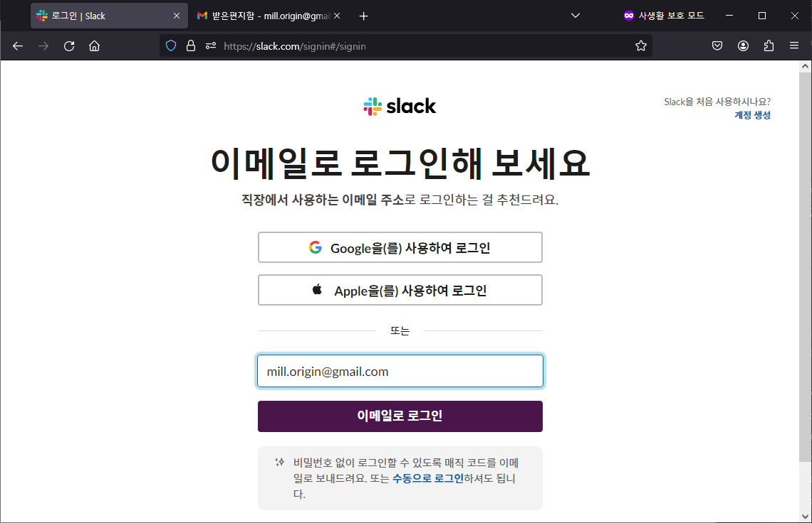
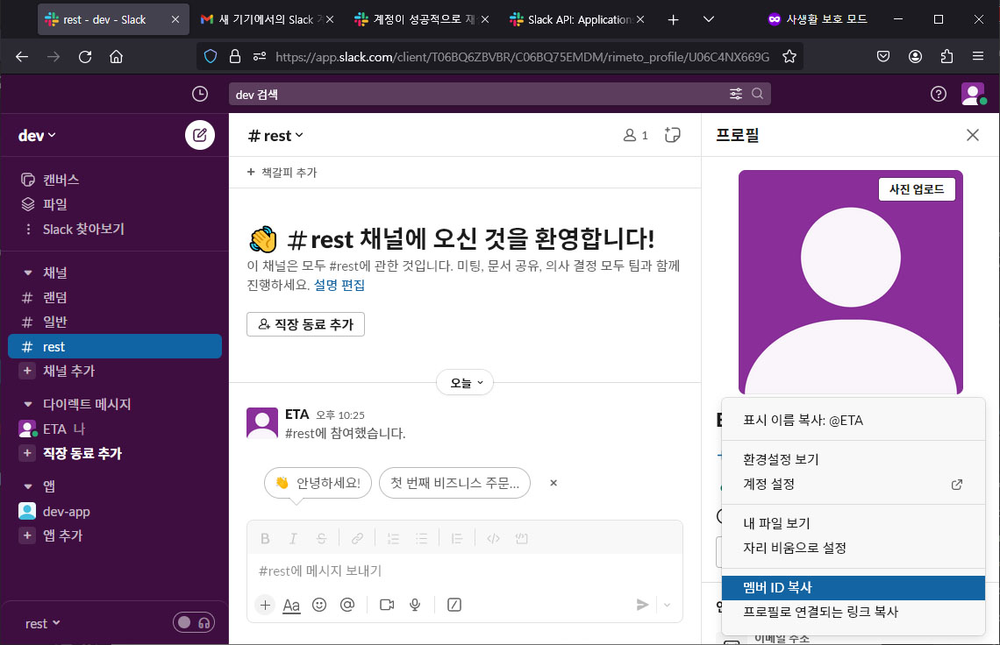
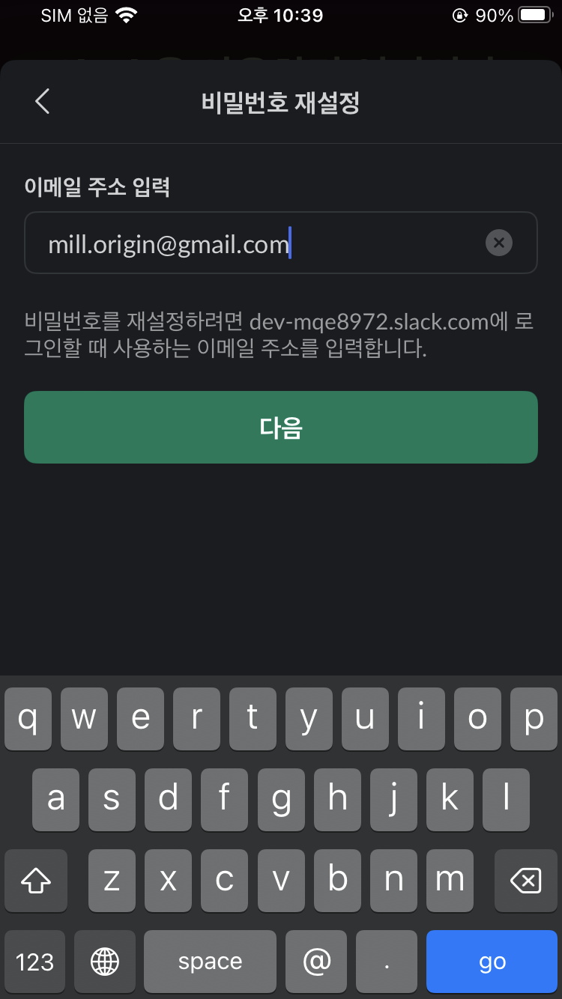

# Slack API 설정

# Table Of Contents

1. [Summary](#1-summary)
2. [Workspace 생성 (이메일-로그인의-경우)](#2-workspace-생성)
3. [App 생성 (`token`)](#3-app-생성-token)
4. [UserID(`target`) 확인](#4-useridtarget-확인)
5. [ChannelID(`target`) 확인 -및 Channel 에 App 추가](#5-channelidtarget-확인-및-channel-에-app-추가)
6. [디바이스 설정 (iOS, 워크스페이스 URL 로그인 의 경우)](#6-디바이스-설정)
7. [알림 테스트 (채널 : CXXXXXXXXXX)](#7-알림-테스트-채널)
8. [알림 테스트 (DM : UXXXXXXXXXX)](#8-알림-테스트-dm)

# 1. Summary

### `token` : _Bot User OAuth Token_

### `target` : _UserID (DM)_ or _ChannelID (그룹전송)_

### Slack Configuration

```text
    계정생성 : https://slack.com/get-started#/createnew
    로그인 : https://slack.com/signin#/signin
    앱생성 : https://api.slack.com/apps
        앱이름 작성, 워크스페이스 선택 후
        OAuth & Permissions > Bots, Permission 할당
            Scopes
                Bot Token Scopes
                    channels:read
                    chat:write
                User Token Scopes
                    channels:read
                    chat:write
        Install App > Workspace 에서 봇을 채널에 추가
    token : OAuth & Permissions > Bot User OAuth Token
    target : https://app.slack.com/ > Your icon > Profile > Vertical 3 dots > Copy member ID
```

### Device Notification

```text
    Device 앱설정 > You > Notifications > Notification Schedule > Every day, Start ~ End 확인
        Start 8:00 AM ~ End 10:00 PM (기본) 이면 이외 시간 (10:01 PM ~ 7:59 AM) 은 알림 동작안함
        Start 6:00 AM ~ End 5:30 AM 으로 설정시 24시간 중 30분만 공백 발생 유지
    Device 앱설정 > You > Pause notifications 꺼짐 확인
    해결이 안될경우 : https://slack.com/help/articles/360001559367-Troubleshoot-Slack-notifications#not-receiving-notifications
    알림뱃지 개수 표시를 위해서는 target 에 채널알림(e.g. CXXXXXXXXXX) 대신 개인알림(DM, e.g. UXXXXXXXXXX) 을 사용해야함
```

# 2. Workspace 생성

## (이메일 로그인의 경우)




`dev` Workspace 생성 예시


`ETA` 사용자 이름 적용 예시


팀원추가는 나중에 해도 무관


`rest` 채널이름 적용 예시


채널 생성 완료


# 3. App 생성 (`token`)

_Create an App_ 버튼 으로 앱생성 시작


_From Scratch_ 선택


_App Name_ 입력, 할당될 workspace 선택 후 _Create App_


_Permissions_ 선택


_Bot Token Scpoes_, _User Token Scpoes_ 섹션에


각각 동일하게 _channels:read_, _chat:write_ 추가


스크롤을 다시 조금 올려 _Install to Workspace_ 버튼으로 현재 앱을 Workspace 에 설치


_허용_


_Bot User OAuth Token_ 을 복사


# 4. UserID(`target`) 확인

채널에 참여 표시된 User(`ETA`) 클릭


오른쪽 패널 생성됨


생성된 패널의 오른쪽 점 3개 버튼을 누르면 _멤버 ID 복사_ 를 할수 있는 컨텍스트 메뉴 출력됨



# 5. ChannelID(`target`) 확인 및 Channel 에 App 추가

왼쪽 패널의 _'채널'_ 의 `rest` > 마우스 우클릭 > _'채널 세부정보 보기'_


레이어 팝업 _'정보'_ 탭 에서 아래로 스크롤 하면 채널 ID 를 복사할수 있음


레이어 팝업 _'통합'_ 탭 에서 _'앱 추가'_ 버튼으로 App 을 채널에 추가


_'추가'_


채널 `rest` 에 앱 `dev-app` 이 추가됨


# 6. 디바이스 설정

## iOS, 워크스페이스 URL 로그인 의 경우

스토어에서 `Slack` 검색 후 설치


초기 화면


알림 켜기


알림 허용


_워크스페이스 URL로 로그인_ 하는 경우


생성했던 Workspace 화면 왼쪽 상단 `dev` 를 눌러보면 워크스페이스 URL 확인 가능 : {WorkspaceName}-xxx.slack.com


확인한 URL 앞 부분을 입력 후 _'계속'_ 버튼으로 진행


계정 이메일 입력 후 비밀번호가 없는 경우 _'비밀번호 재설정'_


입력한 이메일로 비밀번호 재설정 할수 있는 메일이 slack 으로 부터 전송됨



메일 확인 후


비밀번호 재설정


설정한 비밀번호로 로그인


로그인 완료


하단 탭에서 가장 오른쪽 _'나_' 탭을 선택 (_'알림 일시 중지'_ 오른쪽에 _'켜기'_ 라고 표시된 경우는 현재 알림이 off 되어 있다는 상태)


_'나_' > _'알림'_


_'나_' > _'알림'_ > _'알림 일정'_ : 기본 설정은 08:00 ~ 22:00 로 23:00 ~ 07:59 는 알림 동작 안하는 상태


_'나_' > _'알림'_ > _'알림 일정'_ : 설정을 변경해 하루 24시간 중 30분 최소한의 알림 공백만 발생하도록 수정


_'알림 일시 중지'_ 오른쪽에 표시되었던 _'켜기'_ 사라짐 (알림이 on 되어 있어 수신알림이 가능한 상태)


# 7. 알림 테스트 (채널)

## (채널 : CXXXXXXXXXX)

배너 표시되면서 알림소리 재생


채널 알림은 앱 아이콘에 뱃지가 표시되지 않음


채널 `rest` 로 Bot `dev-app` 에게 수신된 알림 확인


# 8. 알림 테스트 (DM)

## (DM : UXXXXXXXXXX)

배너 표시되면서 알림소리 재생 + 앱 아이콘 뱃지 표시


`DM` 부분의 red dot 및 알림 개수 표시


`DM` 으로 Bot `dev-app` 에게 수신된 알림 확인


