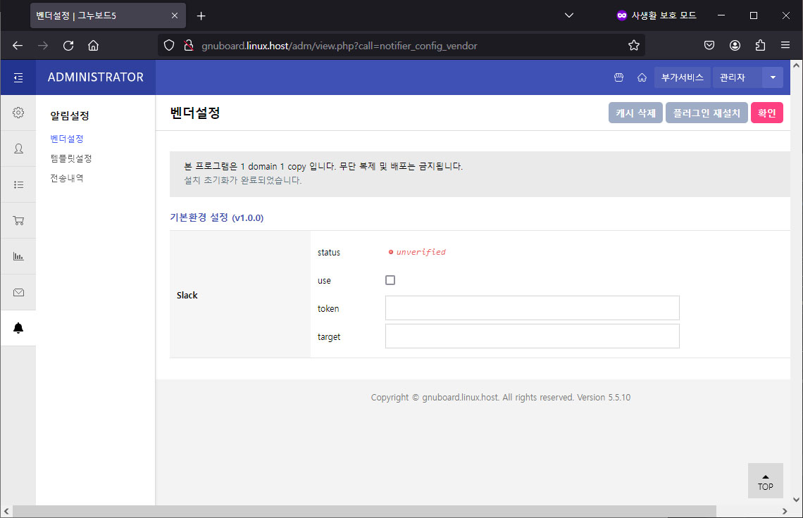
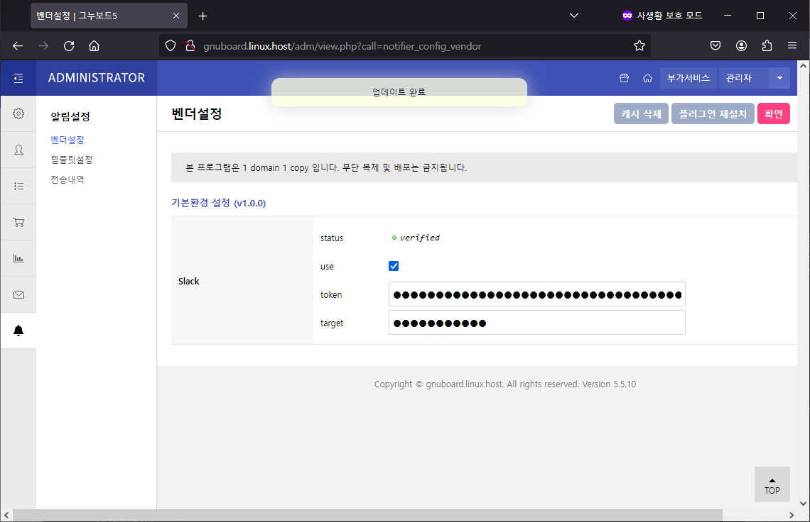
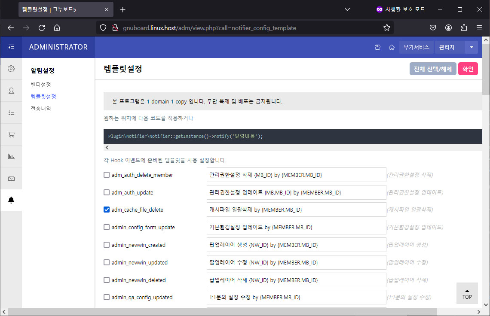
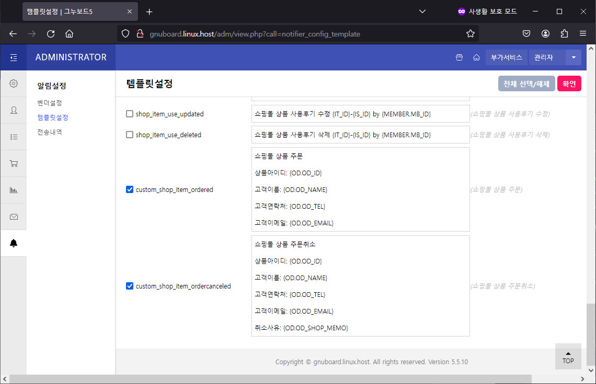
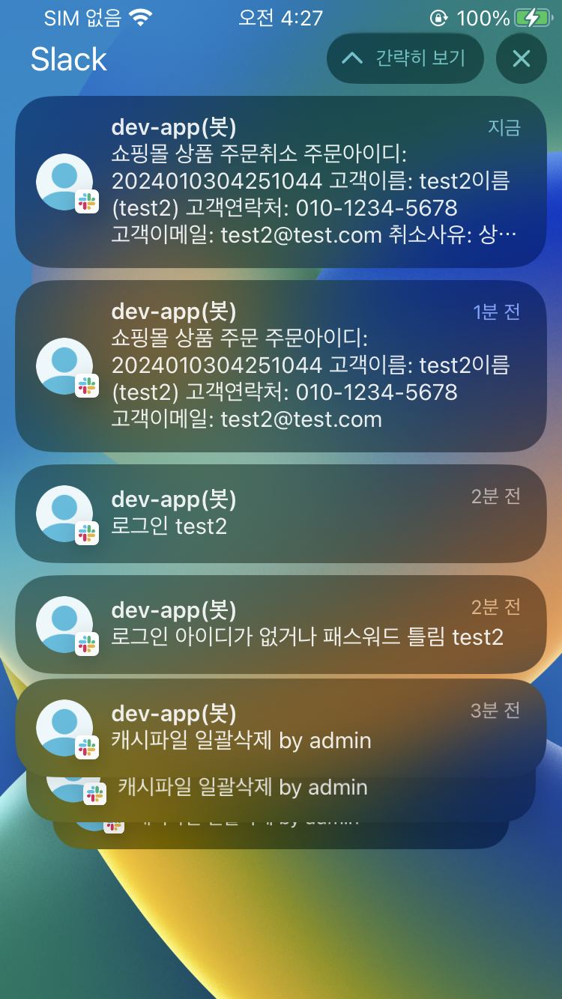
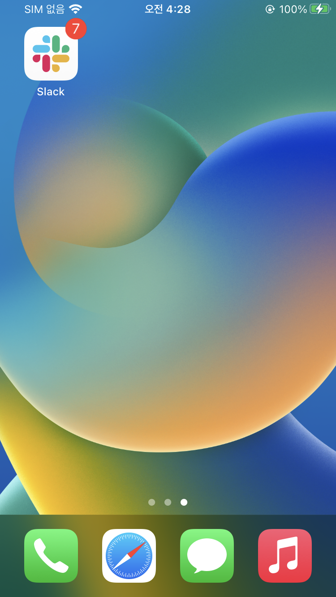
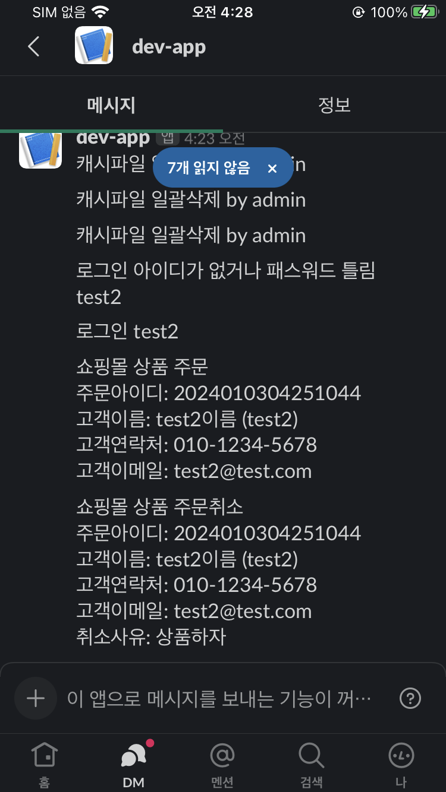
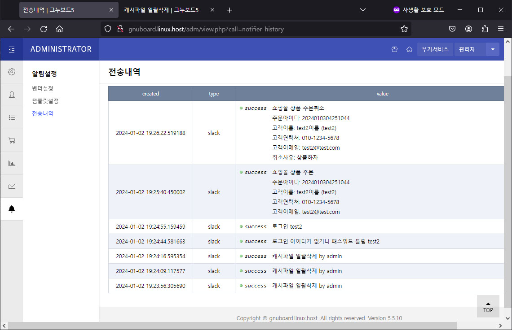

# 그누보드 알림 플러그인

# Table Of Contents

1. [요약](#1-요약)
2. [요구사항](#2-요구사항)
3. [설치](#3-설치)
4. [벤더 설정](#4-벤더-설정)
5. [관리자 벤더설정](#5-관리자-벤더설정)
6. [관리자 설정에 의한 앱 동작 확인](#6-관리자-설정에-의한-앱-동작-확인)
7. [관리자 전송내역](#7-관리자-전송내역)
8. [기타](#8-기타)

# 1. 요약

-   미리 작성된 Hook 기반 이벤트에 등록된 알림을 전송
-   그누보드 코어파일 수정없음
-   Hook 기능을 사용하므로 그누보드 관리자 메뉴 Hook 이 있는 5.4.0.2 버전부터 사용 가능
-   그누보드 5.4.0.2 부터 최신 버전까지 각 해당 버전에 없는 Hook 이벤트는 알림동작 안함
-   미리 준비된 Hook 템플릿 이외 필요한 곳에 직접 알림 함수 사용 가능
-   utf-8 환경에서 안정적으로 동작

# 2. 요구사항

-   php >= 5.5.0
-   php cURL 라이브러리 사용 가능 환경
-   gnuboard >= 5.4.0.2

# 3. 설치

-   압축 해제후 ${DOCUMENT_ROOT} 에 그대로 업로드
    -   ${DOCUMENT_ROOT}/extend
    -   ${DOCUMENT_ROOT}/plugin

# 4. 벤더 설정

## 4-1. Slack API

-   [Slack API 설정 ](README-slack-api.md)
-   관리자 벤더설정을 위해 필요한 값
    -   `token` : _Bot User OAuth Token_
    -   `target` : _UserID or ~~ChannelID (Device 뱃지표시 안됨)~~_

# 5. 관리자 벤더설정

플러그인 설치/재설치 후 관리자 초기화면

`token` (_Bot User OAuth Token_), `target` (_UserID_) 설정 및 사용설정

Hook 템플릿 중 일부 사용설정

# 6. 관리자 설정에 의한 앱 동작 확인

# 7. 관리자 전송내역

# 8. 기타

-   소프트웨어 특성상 구매 후 환불은 불가능
